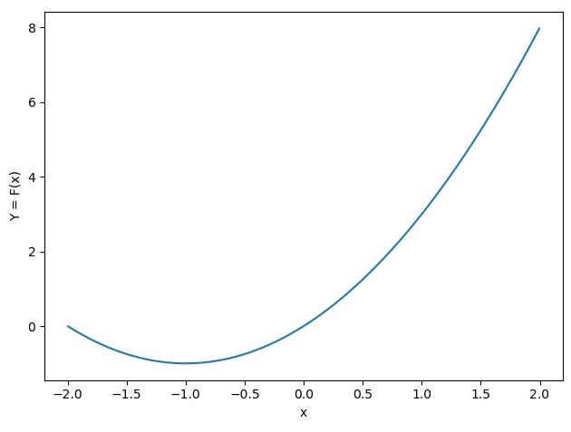
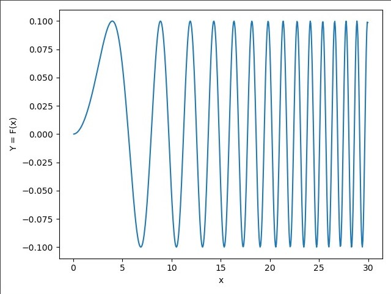

### Graph 1000 random numbers from 1 to 100
```.py
import random
import matplotlib.pyplot as pyplot

# Create list of numbers form 1 to 1000
x = [i for i in range(1, 1000)]

# Generate a random number from 1 to 100 1000 times
y = list()
for i in range(1, 1000):
    rand = random.randrange(1, 100, 1)
    y.append(rand)

print(x)
print(y)

# Create graph
pyplot.plot(x, y)
# Title for axis
pyplot.xlabel('x')
pyplot.ylabel('Y = Random 1 to 100')
# Show graph
pyplot.show()

# Calculate average of the 1000 random numbers
sum = 0
for i in y:
    sum = i + sum
print(f"Average of 1000 random numbers is {sum / 1000}")

```

### Cos graph
```.py
# This program will Graph the equation for the wave function
# cos(x) in the range x = [-10, 10] with steps of 0.5
import math
import numpy
import matplotlib.pyplot as pyplot

a = [n for n in numpy.arange(-10, 10, 0.1)]
b = [math.cos(16*(n*0.5)) for n in a]

# Create graph
pyplot.plot(a, b)
# Title for axis
pyplot.xlabel('x')
pyplot.ylabel('$Y = cos(x)$')
# Show graph
pyplot.show()
```

### SineGraph
```.py
# This program will Graph the equation for the wave function
# 14*sin(0.5*x) in the range x = [-10, 10] with steps of 0.1.
import matplotlib.pyplot as pyplot
import math
import numpy


# Normal for loop does not allow us use decimals so we need to import numpy library
# and use arrange function
x = [i for i in numpy.arange(-10, 10, 0.1)]
y = [14*math.sin(0.5*i) for i in x]

# Create graph
pyplot.plot(x, y)
# Title for axis
pyplot.xlabel('x')
pyplot.ylabel('$Y = 14 * sin(o.5 * x)$')
# Show graph
pyplot.show()
print(x)
print(y)
```

### 1000 Random numbers in order
```.py
# Generate a random number from 1 to 100 1000 times
import random
num = list()
for i in range(1, 1000):
    rand = random.randrange(1, 1000, 1)
    num.append(rand)


# This program will put numbers defined in array in order
    # Looping through the numbers unitl they are in order
    for var in range(len(num)-1, 0, -1):
        for i in range(var):
            # if first number is bigger than second one make seocond number first and first second
            if num[i] > num[i+1]:
                temp = num[i]
                num[i] = num[i+1]
                num[i+1] = temp

print(num)
```
## Homework Feb 21
### Graph 1



**Graph 1** That is graph of the function f(x) = (x+1)^2 - 1

Here is code for it:
```.py
# This program will draw out the graph of f(x) function
import matplotlib.pyplot as pyplot
import math
num = -2
x = []
y = []
# Doing 1000 steps from -2 will get us to 2
for i in range(0, 999):
    num = num + 0.004
    y.append(((num + 1)**2) - 1)
    x.append(num)
# Create graph
pyplot.plot(x, y)
# Title for axis
pyplot.xlabel('x')
pyplot.ylabel('Y = F(x)')
# Show graph
pyplot.show()
```

### Graph 2



**Graph 2** That is graph of the function g(x) = 0.1*sin(0.1*(x^2))
Here is code for it:

```.py

import matplotlib.pyplot as pyplot
import math
num = 0
x = []
y = []
for i in range(0, 599):
    num += 0.05
    x.append(num)
    y.append(0.1 * math.sin(0.1 * (num**2)))

pyplot.plot(x, y)
# Title for axis
pyplot.xlabel('x')
pyplot.ylabel('Y = F(x)')
# Show graph
pyplot.show()
```
